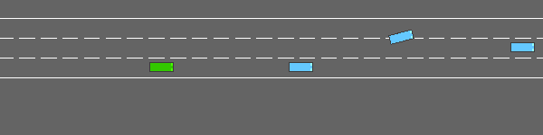
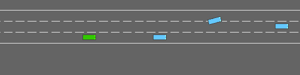

# Autonomous Driving with Deep Reinforcement Learning

A Double DQN agent with a Dueling architecture that drives a car on a three-lane
highway among fifty vehicles, compared against a hand-designed defensive
heuristic and against a human driver.

Reinforcement Learning 2025/2026, University of Padova — Giuseppe D'Auria

---

## The four drivers, same traffic

Each clip is four consecutive episodes on seeds 90000-90003, so the policies are
directly comparable: identical traffic, four different drivers.

### Heuristic baseline
A rule-based defensive policy. Brakes early, merges right when clear, changes
lane only through a verified gap. Crashes on 18% of held-out episodes.



### DQN agent (raw network)
The learned policy, no post-processing. Faster and smoother than the heuristic,
but paired tests show it does **not** significantly improve safety on its own.



### DQN + strict safety filter
Adds a lane-change cooldown, emergency braking and pre-braking near slow
traffic. Crash rate falls to 6%.


### DQN + conservative safety filter — the shipped configuration
Adds a speed cap and restricts lane changes to genuine emergencies.
**1.0% crashes** on a reserved seed block, at no cost in return.


---

## Results

All automated policies evaluated in one identical environment
(`lanes_count=3`, `ego_spacing=1.5`, `vehicles_count=50`, `duration=40`) on the
held-out test seeds `90000+i`, n=100 unless noted.

| Policy | Mean return | Crash rate | Score |
|---|---:|---:|---:|
| Manual control (human, n=10) | 33.41 | 0% | 33.4 |
| **DQN + conservative, fresh holdout (50000+i)** | **29.13** | **1.0%** | **29.0** |
| DQN + conservative filter | 29.33 | 2.0% | 29.1 |
| DQN + strict filter | 29.35 | 6.0% | 28.8 |
| DQN + smooth filter | 29.01 | 9.0% | 28.1 |
| DQN raw network | 28.96 | 10.0% | 28.0 |
| Heuristic baseline | 26.47 | 18.0% | 24.7 |
| DQN last iterate | 26.32 | 31.0% | 23.2 |

Score is `mean_return - 10 x crash_rate`.

**Three findings.**

1. **The learned policy alone does not buy safety.** Against the heuristic, the
   raw network's crash improvement is not significant under a paired McNemar
   test (p=0.169 after Holm correction). Only the filtered configurations
   separate convincingly (conservative p=0.0001).
2. **Lane changes, not speed, cause the residual crashes.** A three-step filter
   ablation isolates the effect in the restriction of discretionary lane
   changes; capping speed alone shows no benefit.
3. **The crashes are decision failures, not perception failures.** Every
   collision examined involved a vehicle that was *already visible* in the
   observation, 17-30 m directly ahead. Enlarging the observation is therefore
   not the first improvement to try.

---

## Quick start

```bash
git clone https://github.com/cocopops9/RL-based_autonomous_driving.git
cd RL-based_autonomous_driving
pip install -r requirements.txt

python evaluate.py            # 10 episodes, finishes in seconds
python evaluate.py --full     # 100 episodes, the protocol reported in the paper
```

The trained weights ship with the repository, so nothing needs training to
reproduce the results.

---

## Technical guide

### Requirements

Python 3.9+ and the pinned versions in `requirements.txt`:

```
gymnasium==1.3.0
highway-env==1.12.0
torch>=2.0
numpy>=1.24
matplotlib>=3.7
pygame>=2.5
imageio>=2.31
imageio-ffmpeg>=0.4
```

A GPU is optional. Training takes roughly 20 minutes on a T4 and a few hours on
CPU; evaluation is CPU-friendly.

### Running each piece

| Command | What it does |
|---|---|
| `python evaluate.py` | Loads `weights/dqn_highway.pt`, evaluates on the test seeds. `--full` for n=100. |
| `python evaluate.py --smooth` | Adds the base safety filter (cooldown + emergency braking). |
| `python evaluate.py --strict` | Adds pre-braking near slow traffic. |
| `python evaluate.py --conservative` | Adds a speed cap and emergency-only lane changes. **Shipped configuration.** |
| `python your_baseline.py` | Runs the heuristic on the same seeds → `results/baseline_results.json`. |
| `python manual_control.py` | Drive yourself with the arrow keys, 10 episodes → `results/manual_control_results.json`. |
| `python training.py` | Trains from scratch, 50k steps. Resumable: re-run after any interruption. |
| `python run_final_eval.py` | Regenerates every row of the results table → `results/final_eval.json`. |
| `python paired_tests.py` | Recomputes McNemar, Holm, paired t and Wilson intervals from stored per-episode vectors. |
| `python crash_diagnosis.py 0 12` | Identifies the collision partner in each crash and whether it was observable. |
| `python plot_results.py` | Regenerates all figures into `results/`. |
| `python visualize.py both` | Opens a window and drives episodes live (needs a display). |
| `python make_media.py` | Re-renders the GIFs above into `media/`. |

### Repository layout

```
.
├── dqn_agent.py              Double DQN + Dueling network, replay buffer, checkpointing
├── training.py               Training loop, seed split, checkpoint selection
├── evaluate.py               Evaluation entry point
├── your_baseline.py          Rule-based defensive heuristic
├── manual_control.py         Human baseline via keyboard
├── safety_filter.py          The three post-processing filters
├── run_final_eval.py         Regenerates the results table
├── paired_tests.py           Statistical tests from stored episode vectors
├── crash_diagnosis.py        Per-crash forensic analysis
├── plot_results.py           Figures
├── visualize.py              Live rendering / clip recording
├── make_media.py             Builds the README animations
├── weights/                  Trained weights (best checkpoint + last iterate)
├── results/                  Logs, figures, and every number in the report
├── media/                    Animations
├── report/                   LaTeX sources (ICML template)
└── rl_autonomous_driving.ipynb   Colab notebook: train, evaluate, visualize
```

### Evaluation protocol

Episode outcomes here are near-binary, which makes small samples treacherous: a
ten-episode run of the shipped model can read 0% crashes where a hundred-episode
run reads 10%. Seeds are therefore split four ways, like data:

| Block | Seeds | Used for |
|---|---|---|
| Training | 0 | The training run itself |
| Selection | `12345+i` | Choosing the best checkpoint |
| Test | `90000+i` | Reported comparisons, and the filter choice |
| Holdout | `50000+i` | One number only: the shipped configuration |

The test block also served to select among the three filters, so the fourth
block exists to give the shipped configuration an unbiased number.

### Reproducing the numbers

```bash
python run_final_eval.py      # all table rows -> results/final_eval.json
python paired_tests.py        # all statistics -> results/paired_tests.json
python plot_results.py        # all figures    -> results/*.pdf
```

Every figure in the report and every value in the table is regenerated by these
three commands from the shipped weights and logs.

### Notes

- The shipped weights predate a configuration fix and were trained at
  `ego_spacing=2.0` while all evaluation uses `1.5`. The direction is
  conservative: the agent learned in the sparser setting and is scored in the
  denser one. Re-running `training.py` will therefore not reproduce them bit for
  bit.
- The selected checkpoint is a mid-training iterate (step 20,801 of 50,000). The
  final iterate crashes on 31% of episodes, below the heuristic, which is why
  checkpoint selection matters here.
- Everything rests on a single training run. Training seed is typically a larger
  source of variance than evaluation seed, and it is not sampled here.

---

## Report

The full write-up is in [`report/main.pdf`](report/main.pdf) (ICML template, 6
pages), covering the environment's critical issues, the baseline design, the
algorithm and its justification, the evaluation methodology, and the discussion.
